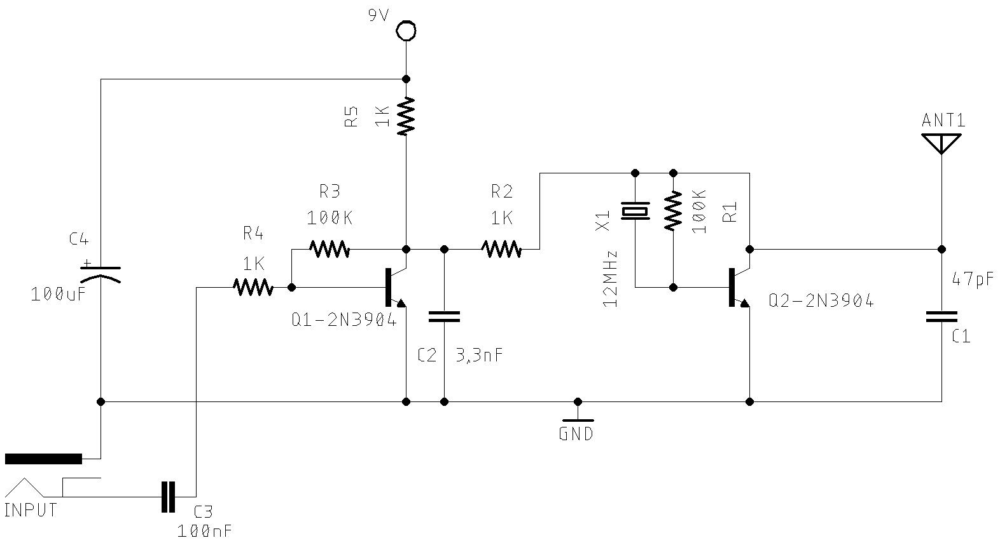
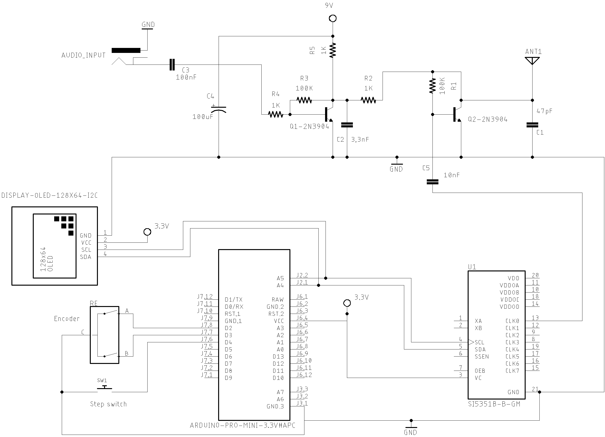

# Shortwave Arduino Transmiter

## IT IS UNDER CONSTRUCTION...

This project is about a shortwave trasmitter with SI5351 oscillator from Silicon Labs controlled by Arduino. Also, you can use it with a crystal oscillator. Is this case, you will not need the SI5351 devive and Arduino. 

## Content

1. [Preface](https://github.com/pu2clr/shortwave_arduino_trasmitter#preface)
2. [Schematic](https://github.com/pu2clr/shortwave_arduino_trasmitter#schematic)
3. [Arduino Sketch](https://github.com/pu2clr/shortwave_arduino_trasmitter/tree/master/source)
4. [References](https://github.com/pu2clr/shortwave_arduino_trasmitter#references)

## Preface 

Recently I have been developing some Arduino libraries to control DSP receivers. The main motivation for building this shortwave transmitter is to be able to do experiments and tests during the development of the Arduino libraries for the SI473X, Si4844, AKC695X, KT0915 and others. My current location does not allow good shortwave broadcast reception most of the time. In this case, a small Shortwave (3 ~ 30 MHz) transmitter can be a good tool.   

This project is originally based  on the [Stefan0719](https://youtu.be/7fe_GlJI5WI) project that uses a crystal oscillator. Instead of a crystal oscillator, this project uses a SI5351 signal generator that can be controlled by Arduino. The idea is to be able to transmit on any frequency in the HF band (3 ˜ 30 MHz).

### See also

The list below shows the Arduino Libraries I have developed to control DSP receivers.  

1. [PU2CLR Si4735 Library for Arduino](https://pu2clr.github.io/SI4735/). This library was built based on “Si47XX PROGRAMMING GUIDE; AN332” and it has support to FM, AM and SSB modes (LW, MW and SW). It also can be used on all members of the SI47XX family respecting, of course, the features available for each IC version;
2. [PU2CLR SI4844 Arduino Library](https://github.com/pu2clr/SI4844). This is an Arduino library for the SI4844, BROADCAST ANALOG TUNING DIGITAL DISPLAY AM/FM/SW RADIO RECEIVER,  IC from Silicon Labs.  It is available on Arduino IDE. This library is intended to provide an easier interface for controlling the SI4844.
3. [PU2CLR AKC695X Arduino Library](https://pu2clr.github.io/AKC695X/). The AKC695X is a family of IC DSP receiver from AKC technology. The AKC6955 and AKC6959sx support AM and FM modes. On AM mode the AKC6955 and AKC6959sx work on LW, MW and SW. On FM mode they work from 64MHz to 222MHz.
4. [PU2CLR KT0915 Arduino Library](https://pu2clr.github.io/KT0915/). The KT0915 is a full band AM (LW, MW and SW) and FM DSP receiver that can provide you a easy way to build a high quality radio with low cost.

## Schematic 

The schematic below is based on [Stefan0719](https://youtu.be/7fe_GlJI5WI) and can be used with crystal oscillator. Use it if you want to work with a static frequency (8MHz, 12MHz, 13.56MHz etc).

If you intend to work with random frequencies between 3 and 30 MHz, use the following circuit.

__UNDER CONSTRUCTION...__

The sketch for the circuit above can be found [here](source)

## References

1. [Original Project Schematic](https://drive.google.com/file/d/1N3GuQzIK2YmYvO7QV10ZkjJ2dLMs-szc/view)
2. [Simple shortwave transmitter](https://youtu.be/7fe_GlJI5WI)
3. [DIY Simple Short Wave Transmitter With XTAL Oscillator Steady Frequency](https://youtu.be/4UGzL5FCcMM)
4. [13.56Mhz shortwave transmitter](https://youtu.be/VYizasHR564)
5. [A DDS VFO for Codan Transceivers](https://www.qsl.net/zl1bpu/PROJ/ddsvfo.htm)
6. [Replacing Crystal Oscillator with DDS](https://electronics.stackexchange.com/questions/139421/replacing-crystal-oscillator-with-dds)
7. [A Technical Tutorialon Digital Signal Synthesis](https://www.analog.com/media/cn/training-seminars/tutorials/450968421DDS_Tutorial_rev12-2-99.pdf)
   
